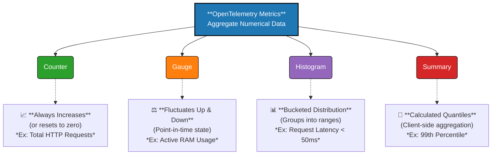

![[Pasted image 20260712182452.png]]

## Metrics:
Logs shine at providing detailed information about individual events. However, sometimes we need a high-level view of the current state of a system. This is where metrics come in. A metric is a single numerical value derived by applying a statistical measure to a group of events. In other words, metrics represent an aggregate.
google developed [dapper](https://research.google.com/pubs/pub36356.html?spm=5176.100239.blogcont60165.11.OXME9Z)
which does the same job ![[36356.pdf]]

# Comprehensive Technical Notes: OpenTelemetry Metrics

## 1. Introduction to Metrics in System Observability
While logs are excellent for providing deep, granular details about individual occurrences (events) within a system, they are often too voluminous and unstructured to provide a rapid, high-level overview of system health. 

To achieve a macro-level view of a system's current state, engineers rely on **Metrics**. 
* **Definition:** A metric is a single numerical value that is calculated by applying a statistical measure to a group of events over a specific period. 
* **Purpose:** Because metrics represent data in an aggregate form, they are extremely compact. This compact representation makes them highly efficient for transmission, long-term storage, and rendering into graphs or dashboards to visualize how a system changes over time.

*Reference:* [Getting Started with OpenTelemetry (LFS148) - Metrics](https://trainingportal.linuxfoundation.org/learn/course/getting-started-with-opentelemetry-lfs148/why-do-we-need-opentelemetry/how-we-got-here?page=3)

---

## 2. The Four Common Types of Metric Instruments
To capture different kinds of numerical telemetry, the observability ecosystem utilizes specific instruments. The four most common metric instruments are:

### 2.1 Counters
* **Behavior:** A value that only increases (or resets to zero). It never decreases. 
* **Use Case:** Counting discrete events, such as total HTTP requests processed, total errors encountered, or bytes sent over a network. 

### 2.2 Gauges
* **Behavior:** A point-in-time value that can arbitrarily go up or down. 
* **Use Case:** Measuring current system states, such as active memory utilization (RAM), CPU temperature, or the current number of active database connections.

### 2.3 Histograms
* **Behavior:** Samples observations and groups them into configurable "buckets" or ranges, tracking the distribution of values over a specific time window. 
* **Use Case:** Measuring things like request latency (e.g., how many requests took < 10ms, 10-50ms, or > 100ms) or response payload sizes. 

### 2.4 Summaries
* **Behavior:** Similar to a histogram, it samples observations but often calculates exact quantiles (e.g., 95th percentile, 99th percentile) directly on the client side before exporting.
* **Note:** While historically popular (especially in Prometheus), OpenTelemetry heavily favors Histograms for their aggregatability across distributed systems.

---

## 3. The Metrics Ecosystem Architecture
To effectively process these compact numerical values, the industry has developed a specialized pipeline structure tailored explicitly for metrics:

1. **Extraction Instruments:** Libraries (like the OpenTelemetry SDK) embedded in the application code to record the raw counters, gauges, and histograms.
2. **Formats and Protocols:** Standardized transmission layers (such as OTLP - OpenTelemetry Protocol) used to securely and consistently transmit the aggregated data.
3. **Time-Series Databases (TSDB):** Highly specialized storage engines (e.g., Prometheus, InfluxDB) optimized for querying chronological, timestamped numerical data rather than relational rows.
4. **Frontends & Visualization:** Dashboarding tools (e.g., Grafana) that query the TSDB to make this continuous data accessible and actionable for end-users and operations teams.

*Reference:* [Getting Started with OpenTelemetry (LFS148) - Metrics](https://trainingportal.linuxfoundation.org/learn/course/getting-started-with-opentelemetry-lfs148/why-do-we-need-opentelemetry/how-we-got-here?page=3)
