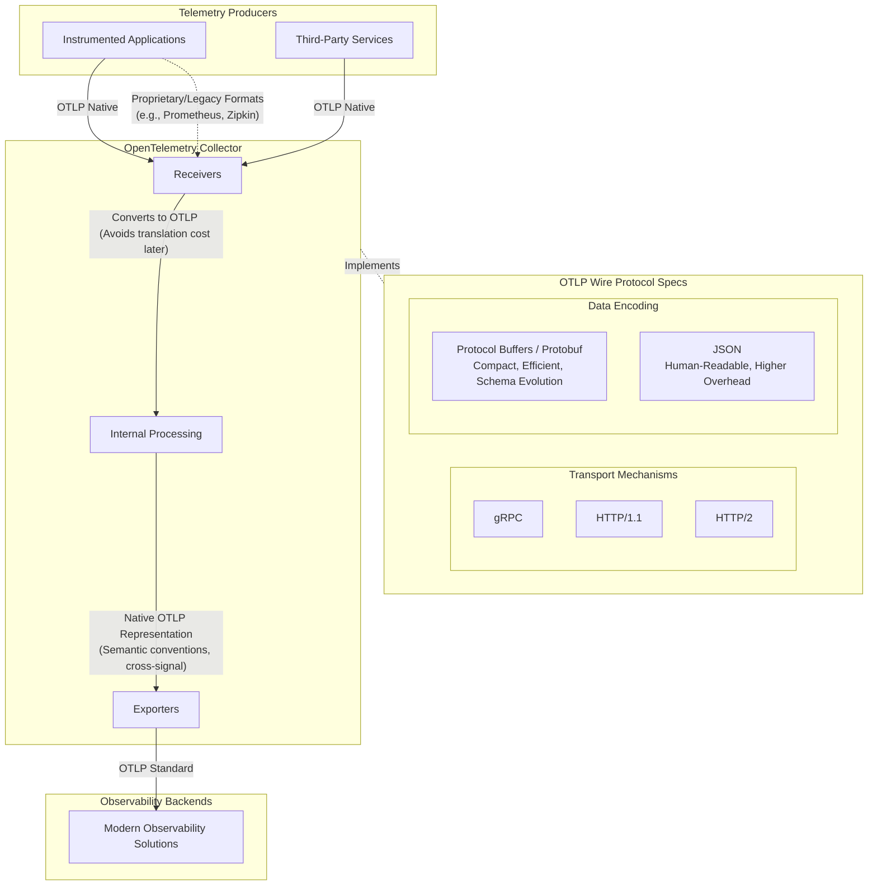

![[Pasted image 20260715211847.png]]
![[Pasted image 20260715214603.png]]
# Getting Started with OpenTelemetry: Wire Protocol Notes

**Source Reference:** [Getting Started with OpenTelemetry (LFS148) - Wire Protocol](https://trainingportal.linuxfoundation.org/learn/course/getting-started-with-opentelemetry-lfs148/overview-of-the-opentelemetry-framework/opentelemetry-framework?page=4)

---

## 1. Introduction to the Wire Protocol
Beyond just standardizing, generating, and managing telemetry data, the OpenTelemetry framework dictates exactly how telemetry should be transported between **producers, agents, and backends**.

## 2. The OpenTelemetry Protocol (OTLP)
The driving force behind this transport standardization is the **OpenTelemetry Protocol (OTLP)**. 
* **Nature:** It is an entirely open-source and vendor-neutral wire format.
* **Core Definitions:** It explicitly defines:
    1.  How telemetry data is structured and encoded in memory.
    2.  The network protocol utilized to transport that encoded data across the network.

## 3. The Role of OTLP in the Observability Stack
By choosing to emit telemetry natively in OTLP, instrumented applications and third-party services instantly become compatible with a vast array of modern observability solutions.

### The OpenTelemetry Collector
* **Format Flexibility:** The Collector is designed to receive telemetry from, and export telemetry to, a variety of legacy and external formats (such as Prometheus Metrics or Zipkin traces).
* **The Internal Preference for OTLP:** Despite this flexibility, OTLP is the preferred format because the Collector uses it internally to represent and process all telemetry.
    * **Cost Efficiency:** Staying in OTLP avoids the CPU overhead and computational cost of translating data between different formats.
    * **System Consistency:** OTLP closely aligns with the framework's native concepts, such as enforcing strict semantic conventions for attributes and enabling seamless cross-signal correlation.

### Backend Support and Interoperability
* **Immediate Compatibility:** Most modern observability backends support OTLP right out of the box.
* **Eliminating Adapters:** In the past, developers had to build countless custom adapters to parse various proprietary formats. An open, standard protocol like OTLP removes this burden.
* **Ecosystem Push:** OTLP acts as a major catalyst for interoperability between disparate tools and services within the observability ecosystem.

## 4. Transport Mechanisms and Encoding Types
OTLP allows you to choose your transport and encoding mechanisms based on specific application requirements, balancing performance, reliability, and security.

### Supported Transport Mechanisms
1.  **HTTP/1.1**
2.  **HTTP/2**
3.  **gRPC**

### Data Encoding Formats
* **Protocol Buffers (Protobuf) - *Standard/Preferred*:** * A binary encoding format.
    * Extremely compact and highly efficient for network transmission.
    * **Schema Evolution:** A major benefit is that it supports schema evolution, allowing the data model to change and upgrade in the future without breaking backwards compatibility.
* **JSON:**
    * A standard text-based format.
    * **Pros:** Highly human-readable, which can aid in manual debugging.
    * **Cons:** Incurs a heavy penalty regarding larger file sizes and significantly higher network traffic overhead compared to Protobuf.

