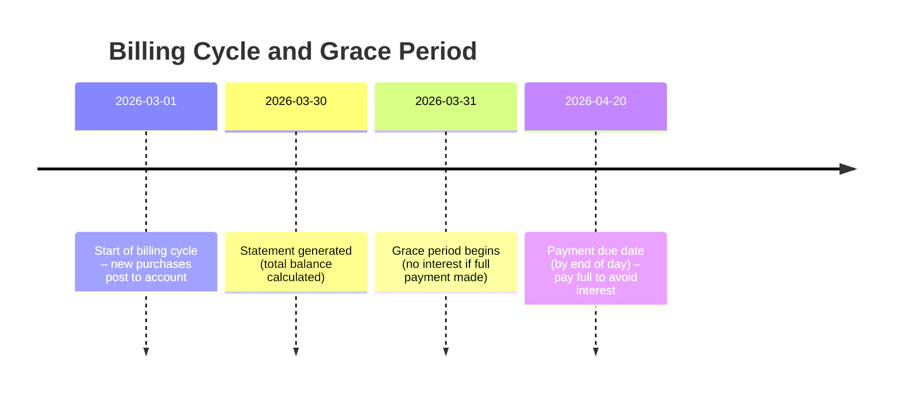

---
tags:
  - finance
  - cards
  - credit
---

# Executive Summary  
Credit cards are revolving loans allowing cardholders to borrow up to a set **credit limit**【13†L1-L4】 and repay monthly. Each month’s spending falls into a **billing cycle** (usually ~28–31 days)【14†L412-L419】, after which a statement is issued. A **due date** (typically 21–25 days later) is set for payment. If the full **statement balance** is paid by the due date, purchases incur no interest during the **grace period**【53†L158-L163】. Otherwise interest (APR) accrues on the unpaid balance from the purchase dates【53†L166-L171】. Credit card issuers profit mainly from interest on carried balances, plus fees. Merchants pay a “merchant discount” (covering interchange and network fees) on each sale【31†L30-L38】; issuers receive the interchange portion. Card issuers also collect annual fees, late fees, cash-advance fees, balance-transfer fees, and foreign-transaction fees. Networks (Visa, Mastercard, etc.) earn small fees on each transaction. Consumers face compound interest and fees if they carry a balance or use cash advances (which usually have no grace period). Paying only the minimum extends debt for years【18†L515-L522】 and harms credit utilization rates【38†L1015-L1023】. Best practice is to pay the full statement balance each month or as much as possible. 

## Key Definitions  
- **Credit Limit:** The maximum credit an issuer allows on a card【13†L1-L4】. Exceeding it can incur penalties or a card cut-off.  
- **Billing Cycle (Statement Period):** The ~month-long period over which transactions are tallied. The statement balance is calculated at its end【14†L412-L419】. (e.g. 1–30 March.)  
- **Statement Closing Date:** The day the billing cycle ends and the statement is generated (e.g. 30 March).  
- **Payment Due Date:** The date by which you must pay at least the minimum to keep the account in good standing. Typically about 21–25 days after the statement date【14†L414-L419】.  
- **Grace Period:** The interest-free window between statement closing and payment due date, during which no interest is charged on new purchases if the previous balance is paid in full【53†L158-L163】. (U.S. law requires ~21 days’ notice of due date【53†L173-L175】.) Grace periods usually apply only to purchase transactions, not cash advances【53†L176-L179】.  
- **Annual Percentage Rate (APR):** The yearly interest rate on balances (purchase APR). Interest compounds daily: the APR ÷ 365 = **daily periodic rate**. For example, a 24% APR ≈ 0.066% per day【34†L139-L148】. If a $1,000 balance is carried over 30 days, interest ≈ $1,000×0.000657×30 ≈ $19.7.  
- **Cash-Advance APR:** A separate (usually higher) rate applied to cash withdrawals on a credit card【23†L108-L115】. Cash advances typically incur a fee (~3–5% of the amount) and **interest from the day of the transaction**【49†L668-L672】【23†L132-L139】 (no grace period【23†L162-L168】).  
- **Penalty APR:** A much higher APR triggered by default (e.g. missing payments)【27†L19-L27】. It applies to your balance and new purchases until you re-establish good standing (often several on-time payments)【27†L19-L27】.  
- **Finance Charge:** The total cost of credit as a dollar amount【29†L91-L95】. It includes interest plus any fees charged on the account (annual fee, late fee, cash advance fee, etc.)【29†L91-L95】【29†L110-L118】. 

## How Credit Cards Work & Revenue Streams  
Banks and card networks run two main “functions” when issuing credit cards【1†L379-L387】:  
- **Transaction Function:** Enables purchases. On each card sale, the merchant’s bank pays an **interchange fee** (set by the network) to the card issuer【1†L379-L387】. Merchants pay their acquirer a “merchant discount” (typically a few percent of each sale), which covers interchange and a network fee【31†L30-L38】. Issuers keep most of this interchange; networks (Visa/Mastercard) take a small fixed slice.  
- **Credit Function:** The issuer lends money for purchases. If you carry a balance, the bank earns **interest income** at your APR【1†L379-L387】. Approximately 75–80% of issuers’ card revenue comes from interest on revolving balances【1†L379-L387】.  

Additional revenue sources include:  
- **Annual Fees:** One-time yearly charges for some cards (especially premium/rewards cards)【47†L420-L423】. Ranges from £0 on many cards up to hundreds of pounds on luxury cards【47†L420-L423】.  
- **Cash-Advance Fees:** Flat or percentage fees (typically 3–5% of the advance, min ~£5–£10)【49†L668-L672】 plus higher APR.  
- **Balance-Transfer Fees:** Charged when moving debt between cards (often 3–5% of transferred amount, £5–£10 min)【47†L460-L465】.  
- **Late Payment Fees:** Charged if the minimum isn’t paid by due date. (In the US this is capped around $30–$41【49†L705-L712】; in the UK it is typically around £12–£15.)  
- **Other Penalty Fees:** E.g. returned payment fees (£30ish), over-limit fees (now only if opted-in)【49†L724-L732】【49†L753-L759】, foreign-transaction fees (often 2–3% of each foreign purchase【49†L687-L694】). 

These all go to the issuer (and sometimes to the network). Overall, banks earn from interchange and interest primarily, with fees making up a smaller share【1†L379-L387】.

*Fig. 1: Example billing cycle timeline. If the £1,000 March balance is paid in full by 20 April, no interest is charged on those purchases【53†L158-L163】【34†L139-L148】. If not, interest accrues from the purchase dates (see text).*

## Interest Calculation (Example)  
Interest is usually calculated using the **Average Daily Balance** method【34†L149-L154】. For each day of the billing cycle, the outstanding balance (after payments/credits) is averaged, then multiplied by the daily periodic rate and number of days【34†L147-L154】. For example, at a 24% APR (daily rate ≈0.066%), a constant £1,200 balance over a 30-day cycle yields interest ≈£1,200×0.000657×30 ≈ £23.7 for the cycle. (If multiple transactions and payments occur, interest is computed on the daily balances.) This compounding (daily accrual) means any carried balance grows quickly. 

## Grace Periods and When Interest Starts  
Most cards offer a grace period on **new purchases**, but only if you owe nothing from prior statements【53†L158-L163】【53†L166-L171】. Concretely: if you pay your statement balance in full by the due date, purchases from that cycle incur **no interest**. But if you carry even £1 into the next cycle (or make only a partial payment), you **lose the grace period**. Then interest is charged on new purchases **from the date of purchase**【53†L166-L171】, not just from the due date. (Regulators require issuers to allow at least 21 days to pay the bill【53†L173-L175】.) Cash advances and some balance transfers typically have no grace period at all: interest (at the higher cash-advance APR) begins immediately on the transaction date【23†L158-L164】【53†L176-L179】. 

## Minimum Payment Explained  
The **minimum payment** is the smallest amount you must pay by the due date to avoid late fees or default. It is usually calculated by a formula: often “a small percentage of your balance plus any interest and fees”【19†L402-L410】. In practice, issuers often use something like: 2–3% of the statement balance (or interest+fees) or a fixed floor amount (e.g. £25), whichever is higher【18†L469-L478】. For example, if a 2% rule applies and your balance is £1,500, your minimum might be £30 (2% of £1,500) plus any interest, or £30 if that is higher than the flat minimum. If your balance is very small (say £20 when the floor is £25), you would simply pay the £20 full balance【18†L472-L481】. The minimum payment is designed to cover a portion of the debt’s financing cost and principal. 

If you only pay the minimum each month, most of the debt remains outstanding, and interest continues to accumulate on the unpaid balance. It can take many years – even decades – to repay the debt if only minimums are paid【18†L515-L522】. Moreover, carrying debt raises your credit utilization ratio (balance ÷ limit), which can hurt your credit score【38†L1015-L1023】. Thus, the minimum payment is a “safety net” to avoid default, not a recommended repayment plan.

## Consumer Impacts and Best Practices  
- **Credit Score:**  Consistently paying on time (at least the minimum) and keeping balances low build a good payment history. High utilization (high balance relative to limit) can *lower* your score【38†L1015-L1023】. Aim to keep utilization under ~30% across cards【38†L1015-L1023】.  
- **Compound Interest:** Any unpaid balance generates daily interest, which compounds. The longer you carry a balance, the more interest (and “interest on interest”) you pay. Even small unpaid amounts cost more over time.  
- **Fees:** Avoiding fees (late, over-limit, etc.) saves money. Late or missed payments can also trigger a penalty APR【27†L19-L27】 and damage your credit record.  
- **Behavioural Tips:** To stay interest-free, always pay your statement balance in full by the due date【53†L158-L163】【16†L93-L100】. Set up autopay for the full balance if possible【16†L93-L100】. If cash is tight, make multiple payments in the cycle or call the issuer for hardship options. Avoid cash advances and other transactions that carry instant interest【23†L158-L164】【49†L668-L672】. Monitor your account online, know your closing date, and plan major purchases just after a statement closing to maximize days before they are due (e.g. buy on 1st of month for up to ~50 days till due【38†L1045-L1047】).  

## Fees: Types and Typical Ranges  
| **Fee Type**             | **Typical Cost**                   | **Notes**                                                       |
|--------------------------|------------------------------------|-----------------------------------------------------------------|
| **Annual Fee**           | £0 – £500+ per year【47†L420-L423】  | Charged yearly on many rewards or premium cards; none on basic cards. |
| **Purchase APR**         | ~18%–30% (variable)                | Interest rate on unpaid purchase balances (with grace if paid in full). |
| **Balance Transfer Fee** | 3%–5% of amount (min ~£5–£10)【47†L460-L465】 | Charged on transferring debt between cards, even if 0% promo APR. |
| **Cash Advance Fee**     | 3%–5% of advance (min ~£5–£10)【49†L668-L672】 | Plus higher cash-advance APR; interest from day of transaction. |
| **Foreign Transaction Fee** | 0%–3% of purchase【49†L687-L694】    | Charged on overseas or foreign-currency transactions; some cards waive it. |
| **Late Payment Fee**     | £12–£30 per missed payment【49†L705-L712】 | Varies by issuer; often waived on first offence or on many UK cards. |
| **Returned Payment Fee** | ~£25–£30                            | If a payment is rejected (e.g. insufficient funds).              |
| **Over-Limit Fee**       | £0 or ~£25 if opted-in            | (Now charged only if you allow the issuer to exceed your limit). |

*Sources: Fee ranges from card issuer disclosures and expert sites【47†L420-L423】【49†L668-L672】【49†L705-L712】.*

## Jurisdictional Notes  
Rules vary by country. For instance, U.S. law (Reg Z/CARD Act) mandates a **21-day billing period** between statement date and due date【53†L173-L175】 and limits penalty fees. In India, RBI guidelines similarly require at least 21 days’ notice, and if you miss full payment, interest is applied only on the outstanding portion from the date of transaction【43†L106-L114】. UK/EU cards often advertise up to ~56 interest-free days (due to flexible billing cycle timing), but the core principle is the same: pay in full to avoid interest. The APRs quoted (and the existence of grace periods) depend on local regulation and terms – always check your card agreement for specifics.

## FAQs

- **What happens if I pay only the minimum?**  Carrying a balance means you’ll pay interest on the rest. Since the minimum barely covers the monthly interest, the balance shrinks very slowly. It can take *years or decades* to clear the debt if only minimums are paid【18†L515-L522】. Meanwhile your utilization stays high (hurting your credit score) and you accrue significant finance charges. Always pay more than the minimum when you can.

- **When does interest start accruing?**  If you pay your full statement balance by the due date, interest on purchases won’t be charged (you keep the grace period)【53†L158-L163】. But if you don’t pay in full (or you make only the minimum payment), the grace period is lost and interest is charged on purchases from the date they were made【53†L166-L171】. Cash advances and some other transactions never have a grace period – interest starts immediately on those transactions【23†L158-L164】【53†L176-L179】.

- **How can I keep interest-free?**  Pay your statement balance in full every month by the due date. This preserves the grace period【53†L158-L163】. Avoid taking cash advances or carrying any balance into the next cycle. Setting up automatic full-pay or even two payments per cycle (one mid-cycle, one at due date) can help. Monitor your billing cycle and due dates, and adjust spending so you can clear the balance each month【16†L93-L100】【53†L178-L184】.

**Sources:** Authoritative bank/CFPB/card network resources and financial guidelines【1†L379-L387】【53†L158-L163】【34†L147-L154】【47†L420-L423】【49†L668-L672】【38†L1015-L1023】 (see citations).

