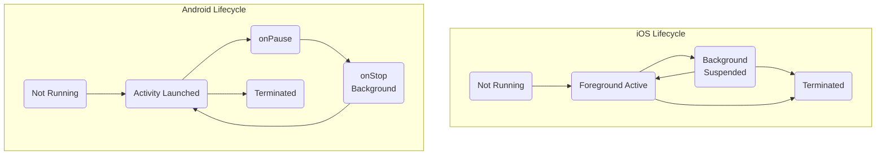

# Platform Limitations: iOS vs Android

**Executive Summary:** Cross-platform mobile development must navigate many platform-specific restrictions. iOS imposes stricter background execution policies, more rigid sandboxing, and a curated App Store with entitlements and review rules. Android offers more flexibility (foreground services, sideloading, external storage) but also has tightened restrictions (background execution limits, scoped storage) and its own Play Store policies. This report compares iOS and Android across key dimensions – app lifecycle, notifications, permissions, distribution, APIs, security, monetization, UI/UX, and platform-specific features – citing official documentation and developer experiences. For each aspect we summarise **What iOS allows vs what Android allows**, the **design impact**, and **workarounds/strategies**, with App Store and Play Store policy references.

## App Lifecycle & Background Execution 

**iOS:**  Apps cannot run arbitrary code in background. Only specific background *modes* (declared in Info.plist) are allowed: **Background Fetch** (system-scheduled, short tasks), **Audio/VoIP/Bluetooth** (e.g. streaming or calls), **Location** (with “Always” permission), **External Accessory**, **Push Notifications**, and (legacy) Newsstand downloads【10†L155-L163】【10†L164-L170】. For example, background fetch runs only a few seconds at unpredictable intervals【10†L155-L163】. There is *no* generic always-on background task. If the user kills an app, no background code runs.  

**Android:**  Android 8+ enforces **Background Execution Limits** to save battery【5†L436-L444】. Apps can schedule deferred work via `WorkManager` or `JobScheduler`, and can run **Foreground Services** (with a persistent notification) for ongoing tasks【5†L436-L444】. Unlike iOS, Android lets apps auto-start on boot (if they request `RECEIVE_BOOT_COMPLETED`) or continue after UI close (via services), but Android O+ restricts background service usage. For periodic sync, Android’s `WorkManager` provides reliable scheduling (e.g. daily), whereas iOS’s fetch might occur only ~1–2 times per day unpredictably.  

**Impact & Workarounds:**  Cross-platform code must use the allowed APIs per OS. On iOS, heavy background work usually requires redesign (e.g. use push notifications to trigger fetch, or use `BGAppRefreshTask` API introduced in iOS 13), whereas on Android one can rely on `WorkManager` or background services (ensuring to show a notification for long tasks). For audio or location, both platforms support background modes, but iOS demands entitlement keys and clear justification. Scheduling a background task should use the highest-level common abstraction (e.g. Flutter’s WorkManager plugin), and detect OS to adjust frequency.  

## Notifications 

**Persistent/Foreground Notifications:**  Android supports always-on “foreground service” notifications for long-running tasks【5†L436-L444】. iOS does *not*: an iOS app can only post a local or push notification, which disappears when the app moves to foreground. There are special *Critical Alerts* and *Time-Sensitive Notifications* on iOS (iOS 15+) that can break Do Not Disturb, but these require a rare Apple entitlement. **Live Activities** (iOS 16+) let an app update a widget on the Lock Screen while running in foreground (e.g. sports scores) but must be launched from a NotificationAction【10†L155-L163】. Android has no exact equivalent to Live Activities, though app widgets can be updated in the background.  

**Push Limits:**  Apple Push Notification Service (APNs) has high throughput; developers note Apple imposes no strict rate limits for App Store apps. Google’s Firebase Cloud Messaging (FCM) also allows large volume, but aggressive use (e.g. very frequent silent pushes) can be throttled. Android notifications have a notification channel system (Android 8+) for grouping and controlling importance; iOS uses categories for actions.  

**Impact & Workarounds:** Design notifications to fit each paradigm. E.g., to simulate a “sticky” indicator on iOS, one might use a widget or repeatedly post local alerts. Limit update frequency to avoid OS throttling. Ensure both systems request permission for push notifications (Android requests automatically at install; iOS requires explicit user opt-in). Always follow policy: e.g., don’t require enabling notifications for core functionality (Apple forbids gating content on notifications【30†L1382-L1384】).  

【61†embed_image】 *Figure: iOS-style notification panel – iOS notifications are time-limited and cannot persist like Android's foreground service notifications. (Image: Unsplash)*

| Notification Feature       | iOS                                               | Android                                           |
|----------------------------|---------------------------------------------------|---------------------------------------------------|
| Persistent/Foreground      | **Not allowed.** Only updates via background tasks. | **Allowed.** Use foreground service + notification【5†L436-L444】.  |
| Critical/Time-sensitive    | *Supported.* Entitlement required for Critical Alerts. | *No equivalent.*                                  |
| Live Activities/Widgets    | *Supported (iOS 16+).* Custom lock-screen widgets (Live Activities). | *Supported.* Home screen widgets with updates.    |
| Push Throttling            | No documented limit (Apple CDC); use judiciously.  | Silent pushes limited by Doze/app idle (Android). |

## Permissions & Privacy 

**Runtime Permissions:**  Both platforms require runtime consent for sensitive data. On Android, dangerous permissions (camera, microphone, location, contacts etc.) must be requested at runtime【32†L561-L570】. Android 6.0+ shows system prompts; users can also toggle in Settings. iOS similarly requests access to location, camera, mic, photos etc., but always via *Privacy* Info.plist keys (e.g. `NSCameraUsageDescription`), and prompts only once (users must manually re-enable if denied). iOS adds a choice to “Allow Once” for location (iOS 13+) and restricts background location (“Always” permission). Both OSes now offer approximate/location-as-needed options (Android 12+ and iOS ~since 2020).  

**Background Location:**  iOS requires an explicit “Always” permission for background use; Apple’s App Store enforces that background location is only used if core to the app’s purpose【26†L1480-L1488】. Google Play policy similarly demands justification for background access【19†L7-L16】. Android 10+ introduced a separate `ACCESS_BACKGROUND_LOCATION` permission and limits update frequency; apps must explain use in a dialog and may face review if not critical to core functionality【19†L7-L16】.  

**Tracking and Data:**  iOS introduced App Tracking Transparency (ATT) on iOS 14.5+: apps must request permission to track users or access the IDFA (identifier for advertisers)【30†L1373-L1381】. Android lets users reset the Advertising ID or opt-out of ad personalization (Android 12 introduced permanent ad-ID reset), but has no required opt-in prompt like ATT. Both platforms restrict clipboard snooping: iOS now notifies users when an app reads the clipboard (iOS 14+).  

**Data Sharing:** Apple’s **App Store Privacy** guidelines (5.1.2) forbid using personal data without consent and require ATT opt-in for any tracking【30†L1373-L1381】. Android’s **Developer Program Policy** mandates a privacy policy and disclosure of data use; Google Play also prohibits collecting sensitive info without a clear privacy policy and user consent. Neither OS allows side-channel data collection (e.g. iOS forbids reading other apps’ contacts/databases; Android 11+ disallows accessing other apps’ private directories【63†L527-L536】).  

| Permission/Data      | iOS                                           | Android                                       |
|----------------------|-----------------------------------------------|-----------------------------------------------|
| Camera/Mic           | Requires `NS...UsageDescription` and runtime prompt. | Requires runtime permission (camera/microphone). |
| Location             | **Foreground:** *Allow Once/While Using* prompt; **Background:** separate “Always” request. Must explain purpose in dialog【26†L1480-L1488】. | **Foreground:** `ACCESS_FINE/COARSE`; **Background:** `ACCESS_BACKGROUND_LOCATION` (Android 10+). Policy: justify use if background【19†L7-L16】. |
| Clipboard            | iOS 14+ notifies on any clipboard read (enhanced privacy). | Android before v14 allowed silent; Android 14 (2023+) introduced similar notification. |
| Contacts/Photos/etc. | `NSContactsUsage` etc. prompts. Apps cannot use data for profiling or share it improperly【30†L1373-L1382】. | Runtime permissions (READ_CONTACTS, READ_MEDIA). Privacy policy required for sensitive data. |

## App Distribution & Review 

**iOS (App Store):** All iOS apps (outside EU/JP exceptions) must use the App Store or TestFlight. Apple enforces strict **App Review Guidelines**. For example, any use of location, push, or tracking must comply with human interface and privacy rules【30†L1373-L1382】【26†L1480-L1488】. Certain **entitlements** are required for specialized APIs (CarPlay, HealthKit, Apple Pay) and are granted case-by-case【28†L229-L233】. Code must be signed by a valid Apple Developer certificate and sandboxed. In the EU (and Japan), Apple now permits alternative app marketplaces and web installs, but all such apps still require an Apple **Notarization** check for malware and basic platform compliance【37†L48-L56】. 

**Android (Google Play):** Android apps typically go through Google Play review, which is largely automated for policy compliance (Google Play policies cover content, user data, etc.). Android permits **sideloading**: users can install APKs from outside the Play Store by enabling “unknown sources,” so distribution is far more open. Android Enterprise and OEMs also allow in-house app distribution. Google Play requires digitally signing APKs, but developers can self-sign (no centralized gatekeeper). Google Play allows alternative stores (e.g. Amazon), and even its own policy changes (in 2022+) let developers offer alternate billing systems in Europe.  

**Impact & Workarounds:** For a cross-platform app, plan for the iOS App Store’s curation. Ensure all required Info.plist keys and entitlements are set, and be ready to justify background uses (e.g. provide Demo Accounts for App Review). On Android, take advantage of side-loading for testing or enterprise use if needed, but comply with Play policies (e.g. do not prompt users to give up permissions). Enterprise distribution: iOS requires an Apple Enterprise ID and device provisioning; Android supports MDM profiles and managed Google Play more easily.  

| Distribution Aspect        | iOS (App Store)                                            | Android (Play Store)                                   |
|----------------------------|-------------------------------------------------------------|--------------------------------------------------------|
| **Primary Store**          | Apple’s App Store (curated, manual review).                 | Google Play Store (automated review + policies).       |
| **Sideloading**            | Generally *not allowed*. (EU/JP allow alternate stores with Notarization)【37†L48-L56】. | **Allowed.** User can enable unknown sources.           |
| **Code Signing & Entitle-ments** | Mandatory Apple signing; special entitlements needed for CarPlay, HealthKit, etc. (2.5.11)【28†L229-L233】. | APK signing required; no additional entitlements beyond Android permissions. |
| **Review Guidelines**      | Strict App Review (no private APIs, clear privacy). Guidelines 5.x cover location, health, etc.【26†L1480-L1488】【30†L1373-L1382】. | Google Play Developer Policies (User Data, Content, etc.); violation can remove app. |

## APIs & Hardware Access 

- **Bluetooth/NFC:** iOS allows Bluetooth LE access (CoreBluetooth) but requires background mode entitlement to scan in background, and restricts what types of BLE operations are permitted (e.g. no arbitrary background BLE scanning beyond CoreBluetooth background mode)【10†L164-L170】. Android also requires `BLUETOOTH_SCAN` runtime permission and (since Android 12) separate `BLUETOOTH_CONNECT`, and imposes scan limits in background. NFC: Android fully supports reading/writing tags and card emulation; iOS’s CoreNFC is limited to certain tag types and (since iOS 13) requires the `Near Field Communication Tag Reading` entitlement; iOS cannot emulate cards as freely as Android can.  

- **File System:** iOS apps are sandboxed: they can only read/write their own container and iCloud Drive (with user permission). There is no general access to shared file directories; sharing files requires UIDocumentPicker or Files app integration. Android uses **Scoped Storage** (Android 10+) restricting access to only app-specific directories or media collections【63†L527-L536】. Android apps may request MANAGE_EXTERNAL_STORAGE for broad file access (risking policy review).  

- **Inter-App Communication:** iOS supports URL schemes and **Universal Links** for app-to-app handoff, and App Groups for data sharing between your own apps. Android’s intent system is richer: apps can expose *Intents* and *Content Providers* for deep links, file sharing (`FileProvider`), and inter-app communication. Android also has advanced app linking (Digital Asset Links) and cross-app app shortcuts.  

- **Widgets & Shortcuts:** iOS Home Screen Widgets (via WidgetKit) are static views updated on a timeline (no live updating code and limited refresh rate). Android widgets (AppWidgets) are more interactive (update via broadcasts) and can include collections. iOS “Shortcuts” (Siri Shortcuts) and App Intents allow some user-defined workflows; Android has App Shortcuts (long-press menu) and App Actions for Google Assistant.  

**Impact & Workarounds:** When using these APIs, use the intersection or detect OS. For example, use Flutter plugins or Cordova packages that abstract file sharing or NFC. If a feature (e.g. custom calendar events, home screen shortcuts) exists on one OS but not the other, provide a fallback or disable it conditionally. Always add required usage descriptions and entitlements (e.g. `NFCReaderUsageDescription`).  

## Security & Sandboxing 

**Code Signing:** iOS enforces strict code signing – every app (and its extensions) must be signed by a certificate from Apple. Dynamic code execution (like JIT or downloading new executable code) is heavily restricted (generally disallowed on App Store apps). Android also requires APKs to be signed, but developers use self-signed keys and sideloading is possible. iOS introduced notarization for Mac apps and for iOS outside App Store (EU/JP), scanning apps for malware【37†L48-L56】.  

**Sandbox:** iOS puts each app in a stringent sandbox (no writing outside its container, no spawning background processes arbitrarily)【25†L12-L18】. Apps can’t auto-launch on device boot; Apple guidelines specifically ban auto-launch or running after quit without user action【25†L12-L18】. Android apps run in a Linux sandbox per UID; they also cannot out-of-the-box run on boot unless they have the `RECEIVE_BOOT_COMPLETED` permission. On Android, apps can use services (including in background) but must respect background limits (Android 8+).  

**Entitlements & Capabilities:** Apple uses **entitlements** to grant capabilities (e.g. `com.apple.developer.healthkit`). Only apps with the entitlement (granted by Apple) can use certain APIs. Android uses the permission model; some functions (like drawing over other apps) require user toggle or special permission (e.g. `SYSTEM_ALERT_WINDOW`).  

**Impact & Workarounds:** Security-sensitive code should be written with OS sandboxing in mind. For cross-platform frameworks, use library abstractions (e.g. Android Keystore vs iOS Keychain APIs) and ensure one doesn’t expect file sharing unless using explicit share intents. Test on both platforms for behaviors like app kill: iOS will not restart a killed app for background fetch, while Android may.  

| Security Aspect           | iOS                                                   | Android                                               |
|---------------------------|-------------------------------------------------------|-------------------------------------------------------|
| **Sandbox**               | Each app has a strict sandbox; no background processes beyond allowed modes【25†L12-L18】. | Apps run in a sandbox (unique Linux uid). Services can run in background (subject to limits). |
| **Code Signing / Notarization** | Mandatory Apple signing. Alternate markets (EU/JP) require Apple notarization check【37†L48-L56】. | APK must be signed (self-signed keys). Play Protect scans on install. No formal notarization. |
| **Dynamic Code**          | Disallowed on App Store (except scripting languages within limits). | Generally disallowed by Play Policy (some dynamic loading exceptions for cross-platform tools). |
| **Startup/Autolaunch**    | *Not allowed.* Apps can’t auto-launch on boot【25†L12-L18】. | Allowed via BOOT_COMPLETED broadcast (with permission), though newer Android versions impose more restrictions. |

## Monetization & In-App Purchases 

**iOS In-App Purchase (IAP):** Apple requires that in-app purchases of digital goods (premium content, subscriptions, unlocks, in-game currency, etc.) use the App Store’s IAP system【40†L43-L51】. Apple takes a commission (15–30%). Physical goods/services must use external payment (Apple Pay or web). Apple’s guidelines (3.1.1) forbid alternative payment methods for digital content, with limited exceptions (e.g. “reader” apps can link externally in US after obtaining an External Purchase Link entitlement【40†L43-L51】). Subscriptions must be offered via IAP with transparent terms.  

**Android Billing:** Google Play mandates use of **Play Billing Library** for digital content sold within the app【43†L474-L483】. For physical goods or ride-sharing, Google Pay or other processors are allowed. Play’s fee is also 15–30% (15% on first $1M per year). Recent regulatory changes (e.g. EU Digital Markets Act) now let Android apps offer alternative billing or third-party stores in certain regions.  

**Alternative Payments:** On iOS, linking to external purchase outside the app was largely forbidden until 2022; now “reader” apps and some apps in the EU can present an external link under strict guidelines【40†L43-L51】. Google has likewise introduced optional billing systems for non-GMS (Google Mobile Services) regions and in the EU (each alternative incurs a 3% fee to Google).  

**Impact & Workarounds:** For cross-platform apps, maintain a unified product catalog but implement platform-specific purchase flows. Typically use each platform’s billing SDK: StoreKit on iOS, Play Billing on Android. Clearly differentiate digital vs physical sales to comply. Update store listing metadata to describe any external purchase links if used. Be aware of each store’s rules on free trials, subscriptions (see App Store 3.1.2) and refunds.  

| Payment/Store Aspect       | iOS (App Store)                                           | Android (Google Play)                         |
|----------------------------|-----------------------------------------------------------|----------------------------------------------|
| **Digital goods**          | *Must use Apple IAP.* (3.1.1)【40†L43-L51】. No steering to web checkout. | *Must use Google Play Billing* for in-app digital sales【43†L474-L483】. |
| **Subscriptions**          | Auto-renew subs via IAP; price increases require notice.   | Google Play subs with `SUBSCRIPTION` SKU. Auto-renew rules similar. |
| **Alternative methods**    | Forbidden except “reader” apps (magazines, audio/video) can link externally (US only by entitlement)【40†L43-L51】. | Historically none; now allowed outside GMS or EU per new rules (with 3% fee). |
| **Physical goods/services**| Use Apple Pay or external payment. No IAP required.        | Use Google Pay or external. IAP prohibited.  |

## UI/UX Constraints 

【57†embed_image】 *Figure: Example Android (left) and iOS (right) home screens – Android supports more home screen customization and widgets, whereas iOS has a more controlled layout. (Image: Unsplash)*

- **Home Screen & Widgets:** Android launchers allow placing app icons anywhere, using **App Shortcuts**, and adding interactive widgets of any size. iOS only recently allowed Home Screen widgets (static, with limited interactions) and no custom launchers; app icons must follow the grid. iOS **Live Activities** can appear on the Lock Screen but must be driven by notifications.  

- **Multitasking:** iPhone apps run full-screen. On iPad, iOS supports Split View and Slide Over, but each app runs as its own separate scene (UIKit manages multiple windows). Android devices generally support multi-window or split-screen for any app since Oreo. Android has a system **Back** button requiring special handling in the UI; iOS has no hardware back button (navigation driven by in-app UI).  

- **System UI Customisation:** Android allows more system-level UI changes (immersive mode hiding status bar, custom nav gestures) than iOS. iOS UI is more uniform: e.g. status bar style, modal presentations, Safe Area insets must be respected. Apps must adhere to each platform’s Human Interface Guidelines (Apple’s HIG and Google’s Material/Android Design guidelines) for navigation paradigms, so some cross-platform UI components may need platform-specific adjustments.  

- **Notifications & Alerts:** As above, Android’s notifications are persistent by default; iOS alerts are ephemeral. UI elements like `UIAlertController` (iOS) and `Dialog` (Android) have different look-and-feel and thread requirements. Cross-platform frameworks often provide abstractions (e.g. Flutter’s widgets), but test on each OS to ensure conformity.  

## Platform-Specific Features 

- **Voice Assistants:** iOS offers SiriKit/Shortcuts for voice commands and automated workflows; apps can donate shortcuts to Siri. Android uses Google Assistant and App Actions. A cross-platform app can provide custom voice interactions via each SDK (e.g. implementing Siri Intents on iOS and an Actions.xml on Android).  

- **Health & Sensors:** Apple’s HealthKit provides rich biometric and fitness data (heart rate, sleep, step count) which requires specific entitlements and HealthKit usage description. Android’s counterpart is Google Fit (via Google Play Services) or platform sensors. On iOS, use HealthKit APIs (with user permission) and note that such data cannot be misused or shared (App Store rule 5.1.3). Android apps must also declare any health data usage and comply with Play policies.  

- **In-Car & Wearables:** CarPlay on iOS allows navigation, audio, messaging apps to show minimal UIs; an entitlement (CarPlay Audio, etc.) is required【28†L229-L233】. Android’s equivalent is Android Auto. Apple Watch apps must be bundled or separate targets; Wear OS (Android) apps are separate APKs. A cross-platform strategy might share logic (e.g. using Kotlin Multiplatform) but implement platform UI separately.  

- **Payments & Wallets:** Apple Pay integration (via PassKit) requires specific entitlements and is available only on iOS devices with the Wallet. Google Pay (formerly Android Pay) is available on Android via SDK. Subscription and payment flows should use each platform’s preferred UI (e.g. PKPaymentButton vs Google Pay Button) to maximise user trust.  

**Checklist for Cross-Platform Design:**  
- **Background Tasks:** Does the app need background execution? If so, use iOS Background Modes (and request entitlement), and Android WorkManager/ForegroundService. Test that tasks run in the allowed conditions on both OSs.  
- **Permissions & Privacy:** List all required user data permissions (location, camera, mic, etc.). For each, add the required descriptions in iOS Info.plist and implement Android runtime requests. Provide clear in-app explanations to comply with App Store guidelines【30†L1373-L1382】. Ensure tracking/Ads-ID compliance (iOS ATT prompt, Android opt-out).  
- **Notifications:** Decide which alerts are “time-sensitive.” Use Android persistent notifications for any ongoing service. On iOS, avoid relying on a notification to convey critical static UI; instead use Live Activities or widgets.  
- **UI Alignment:** Follow each OS’s design patterns for navigation (e.g. bottom nav on iOS, drawer/gesture on Android). Use responsive layouts – consider iPad multi-windows vs Android split-screen. Handle safe areas and notch layouts. Use platform-specific assets or styles as needed.  
- **API Fallbacks:** For hardware features not available on one OS (e.g. NFC on iPhone), check at runtime and disable UI if not supported. Provide alternatives: e.g. if direct file access isn’t allowed, use a file picker.  
- **Store Compliance:** Review App Store Guidelines (especially sections on **Privacy (5.x)**, **Health (5.1.3)**, **Payments (3.1.x)**, **Background (2.5.x)**) and Google Play Policies (User Data, IAP rules). For any borderline feature, prepare justification and privacy documentation.  
- **Testing:** Test on latest iOS and Android versions. Watch for platform differences like memory management (iOS may kill background apps more aggressively), notification behavior, and permission revocation scenarios. Use emulators and real devices.  

Each of the above comparisons affects architecture and UX. By explicitly designing around these differences – using conditional code paths, abstracting platform services, and following each platform’s rules – developers can build robust cross-platform apps. Always consult the latest Apple Developer documentation and Google Play policies for updates, and incorporate user feedback to refine the app’s behaviour on both iOS and Android. 

