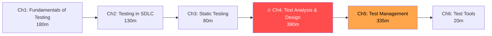
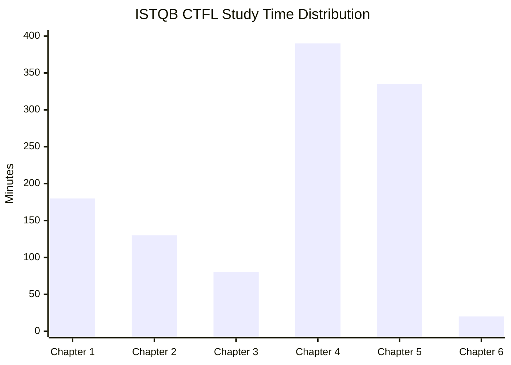
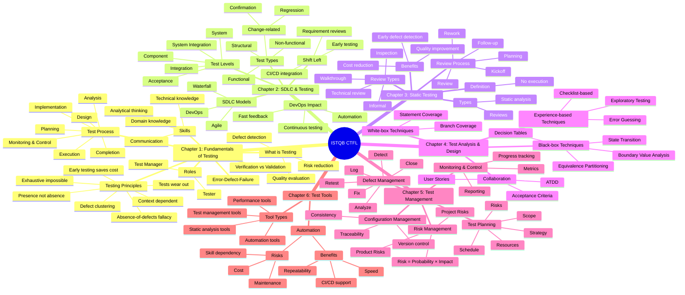

```mermaid
flowchart LR
    C1["Ch1: Fundamentals of Testing<br>180m"] --> 
    C2["Ch2: Testing in SDLC<br>130m"] --> 
    C3["Ch3: Static Testing<br>80m"] --> 
    C4["🔥 Ch4: Test Analysis & Design<br>390m"] --> 
    C5["Ch5: Test Management<br>335m"] --> 
    C6["Ch6: Test Tools<br>20m"]

    C4:::high
    C5:::medium

    classDef high fill:#ff4d4d,color:#fff
    classDef medium fill:#ffa64d,color:#000
```

```mermaid
xychart-beta
    title "ISTQB CTFL Study Time Distribution"
    x-axis ["Chapter 1", "Chapter 2", "Chapter 3", "Chapter 4", "Chapter 5", "Chapter 6"]
    y-axis "Minutes" 0 --> 400
    bar [180, 130, 80, 390, 335, 20]
```

```mermaid
mindmap
  root((ISTQB CTFL))

    Chapter 1: Fundamentals of Testing
      What is Testing
        Defect detection
        Quality evaluation
        Risk reduction
      Verification vs Validation
      Error-Defect-Failure
      Testing Principles
        Presence not absence
        Exhaustive impossible
        Early testing saves cost
        Defect clustering
        Tests wear out
        Context dependent
        Absence-of-defects fallacy
      Test Process
        Planning
        Monitoring & Control
        Analysis
        Design
        Implementation
        Execution
        Completion
      Roles
        Test Manager
        Tester
      Skills
        Analytical thinking
        Communication
        Technical knowledge
        Domain knowledge

    Chapter 2: SDLC & Testing
      SDLC Models
        Waterfall
        Agile
        DevOps
      Shift Left
        Early testing
        Requirement reviews
        CI/CD integration
      Test Levels
        Component
        Integration
        System
        System Integration
        Acceptance
      Test Types
        Functional
        Non-functional
        Structural
        Change-related
          Regression
          Confirmation
      DevOps Impact
        Automation
        Continuous testing
        Fast feedback

    Chapter 3: Static Testing
      Definition
        No execution
      Types
        Reviews
        Static analysis
      Benefits
        Early defect detection
        Cost reduction
        Quality improvement
      Review Types
        Informal
        Walkthrough
        Technical review
        Inspection
      Review Process
        Planning
        Kickoff
        Review
        Rework
        Follow-up

    Chapter 4: Test Analysis & Design
      Black-box Techniques
        Equivalence Partitioning
        Boundary Value Analysis
        Decision Tables
        State Transition
      White-box Techniques
        Statement Coverage
        Branch Coverage
      Experience-based Techniques
        Error Guessing
        Exploratory Testing
        Checklist-based
      Collaboration
        User Stories
        Acceptance Criteria
        ATDD

    Chapter 5: Test Management
      Test Planning
        Scope
        Strategy
        Resources
        Schedule
        Risks
      Risk Management
        Risk = Probability × Impact
        Project Risks
        Product Risks
      Monitoring & Control
        Metrics
        Progress tracking
        Reporting
      Defect Management
        Detect
        Log
        Analyze
        Fix
        Retest
        Close
      Configuration Management
        Version control
        Traceability
        Consistency

    Chapter 6: Test Tools
      Tool Types
        Test management tools
        Automation tools
        Performance tools
        Static analysis tools
      Automation
        Benefits
          Speed
          Repeatability
          CI/CD support
        Risks
          Cost
          Maintenance
          Skill dependency
```
