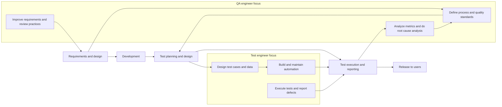

Testing is a product-oriented, corrective approach that focuses on those activities supporting the
achievement of appropriate levels of quality. Testing is a major form of quality control, while others
include formal methods (model checking and proof of correctness), simulation and prototyping.
QA is a process-oriented, preventive approach that focuses on the implementation and improvement of
processes. It works on the basis that if a good process is followed correctly, then it will generate a good
product. QA applies to both the development and testing processes, and is the responsibility of everyone
on a project.
Test results are used by QA and testing. In testing they are used to fix defects, while in QA they provide
feedback on how well the development and test processes are performing.## QA engineer vs test engineer in simple terms

- **QA Engineer (Quality Assurance)**
    
    - Focus: **Processes and overall quality system**.
        
    - Goal: Prevent defects by improving how the team works (requirements, development, testing process, standards).
        
    - Typical responsibilities:
        
        - Define and improve test processes, standards, and checklists.
            
        - Analyze requirements for testability and quality.
            
        - Plan test strategy, test approach, and test metrics.
            
        - Do RCA on defects and suggest process improvements.
            
        - Often involved across the whole SDLC, not just execution.
            
- **Test Engineer**
    
    - Focus: **Product and tests themselves**.
        
    - Goal: Find defects by designing and executing tests (manual + automation) on the actual system.
        
    - Typical responsibilities:
        
        - Design test cases, test data, and automated suites.
            
        - Execute tests at different levels (unit, integration, system, etc.).
            
        - Log defects, re-test fixes, maintain regression suites.
            
        - Use tools/frameworks (Playwright, RestAssured, etc.) to ensure coverage and reliability.
            

You can think of it like this:

- **QA engineer**: “How can we change our process so such bugs don’t happen again?”
    
- **Test engineer**: “How can I design and run tests to reveal these bugs as early as possible?”
    

---

## Practical example (close to your world)

Imagine a SaaS product with a new “Optimize Route” feature.

- **Test engineer:**
    
    - Reads the user story and acceptance criteria.
        
    - Designs test cases: valid route, invalid addresses, huge number of stops, performance under load.
        
    - Automates main flows with Playwright/RestAssured.
        
    - Runs tests in CI, finds failures, logs defects, supports debugging.
        
- **QA engineer:**
    
    - Ensures the user story template enforces clear acceptance criteria (no ambiguity).
        
    - Defines “Definition of Ready” and “Definition of Done” that include quality gates (review, coverage, performance checks).
        
    - Reviews test strategy: which levels, which environments, which non-functional tests.
        
    - After a production incident, leads RCA and updates standards/templates to prevent similar issues.
        

In small companies, one person often does both, but conceptually ISTQB thinking is: **testing is part of QA; QA is bigger than just testing**.

