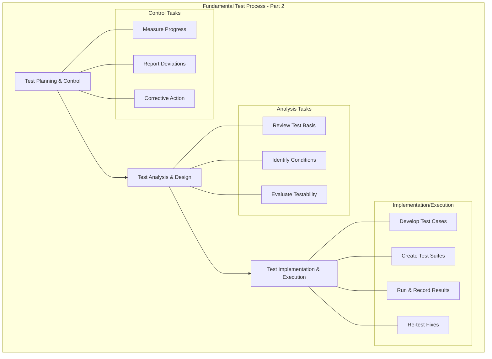

# ISTQB Foundation Level: Fundamental Test Process (Part 2)

These notes cover the continuation of the fundamental test process, focusing on **Test Control**, **Test Analysis & Design**, and **Test Implementation & Execution**.

---

## 1. Test Control
Test control is an ongoing activity that involves comparing actual progress against the planned progress and taking corrective actions.

### Key Characteristics
* **Ongoing Activity:** It happens throughout the project, not just at one level [00:01:00].
* **Measurement:** Uses criteria to monitor daily progress, such as defect reports (raised, in-progress, fixed) and execution status [00:01:20].
* **Reporting:** Communicates status and any deviations from the plan to stakeholders [00:02:18].

### Major Tasks [00:03:37]
* **Measure and Analyze:** Track pass/fail percentages and remaining test cases [00:04:04].
* **Monitor Progress:** Document coverage and evaluate against **Exit Criteria** [00:04:38].
* **Information Distribution:** Provide regular progress reports to stakeholders [00:05:15].
* **Corrective Actions:** Initiate changes if the project is off-track (e.g., hiring more resources or prioritizing high-risk modules) [00:05:52].
* **Release Decisions:** Gather data to decide if the software is ready for release based on remaining defect priority [00:08:34].

---

## 2. Test Analysis and Design
This phase involves building the test designs and procedures based on the "Test Basis."

### Major Tasks [00:10:24]
* **Review the Test Basis:** Analyze requirements (SRS), design documents, and existing systems to identify gaps [00:11:13].
* **Identify Test Conditions:** Determine what parts of the system are testable [00:12:49].
* **Design Tests:** Apply techniques like **Boundary Value Analysis** or **Equivalence Partitioning** [00:13:16].
* **Evaluate Testability:** Ensure requirements are clear and measurable (e.g., defining "fast" as "response under 5 seconds") [00:14:27].
* **Design Environment:** Determine necessary hardware, software, and management tools [00:16:20].

---

## 3. Test Implementation and Execution
This is where test conditions are converted into concrete test cases and then run against the system.

### Test Implementation Tasks [00:17:46]
* **Develop & Prioritize:** Turn conditions into test cases and rank them by risk [00:18:34].
* **Create Test Suites:** Group tests logically (e.g., Regression Suite, Functional Suite) [00:19:07].
* **Prepare Environment:** Set up the physical or virtual environment for execution [00:19:46].

### Test Execution Tasks [00:20:11]
* **Record Outcomes:** Note the environment, software version, and browser used [00:21:06].
* **Actual vs. Expected:** Compare results; if they don't match, report an **Incident** or **Defect** [00:21:30].
* **Re-testing:** After a developer fixes a bug, re-run the test to ensure the correction works [00:22:34].

---

## Process Flow Diagram

