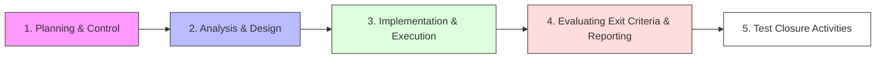

# ISTQB Foundation Level: Fundamental Test Process (Part 3)

These notes cover the final stages of the fundamental test process: **Evaluating Exit Criteria & Reporting** and **Test Closure Activities**.

---

## 1. Evaluating Exit Criteria and Reporting
This activity involves assessing test execution against defined objectives and communicating the status.

### Core Concept
* **Definition:** Assessing whether test execution has met the goals set during the planning phase [00:00:23].
* **Frequency:** This must be performed for **each test level** [00:01:34].
* **Purpose:** Ensures enough testing has been done to safely exit a testing phase [00:01:51].

### Major Tasks [00:02:33]
* **Check Test Logs:** Compare actual results (execution %, defects fixed/outstanding) against the Test Plan [00:03:12].
  * *Example:* 95% execution required; no Sev-1 or Sev-2 defects open [00:03:36].
* **Assessment & Adjustment:** Determine if more tests are needed or if the exit criteria should be modified [00:04:26].
  * Note: Changing criteria requires stakeholder consultation and should generally be avoided unless risks have shifted [00:06:40].
* **Test Summary Report:** Prepare a report for stakeholders to help them make informed release decisions [00:07:45].

---

## 2. Test Closure Activities
Closure activities consolidate experience and archive data from completed test activities.

### Major Tasks [00:08:34]
* **Verification of Deliverables:** Ensure all planned deliverables (plans, cases, strategy) have been provided [00:09:19].
* **Incident Resolution:** Ensure all incident reports are either fixed or deferred [00:09:43].
* **Finalize and Archive Testware:** Archive test plans, scripts, and environment details for later use [00:10:01].
* **Handover to Maintenance:** Pass archived testware to the organization responsible for maintaining the software [00:11:03].
* **Lessons Learned:** Analyze what went well and what failed to improve future projects [00:12:11].
  * *Goal:* Dig into root causes of high defect counts to improve development and test processes [00:13:24].

---

## Summary of the 5-Step Fundamental Test Process

