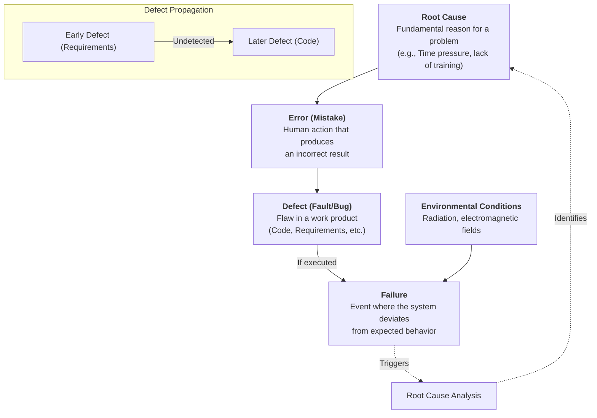

```mermaid
graph TD
    RC["<b>Root Cause</b><br/>Fundamental reason for a problem<br/>(e.g., Time pressure, lack of training)"]
    
    E["<b>Error (Mistake)</b><br/>Human action that produces<br/>an incorrect result"]
    
    D["<b>Defect (Fault/Bug)</b><br/>Flaw in a work product<br/>(Code, Requirements, etc.)"]
    
    F["<b>Failure</b><br/>Event where the system deviates<br/>from expected behavior"]
    
    ENV["<b>Environmental Conditions</b><br/>Radiation, electromagnetic fields"]

    RC --> E
    E --> D
    D -->|"If executed"| F
    ENV --> F
    
    subgraph SDLC ["Defect Propagation"]
        D1["Early Defect (Requirements)"] -->|"Undetected"| D2["Later Defect (Code)"]
    end

    F -.->|"Triggers"| RCA["Root Cause Analysis"]
    RCA -.->|"Identifies"| RC

```

