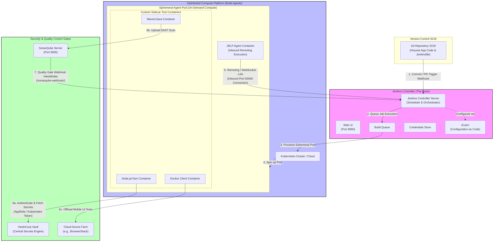
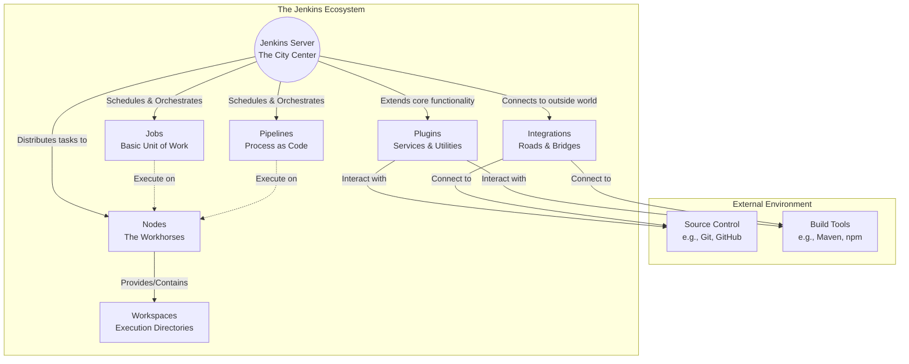

![[Human Error Impact Analysis-2026-07-30-061126.png]]

- **Jenkins Server:** The central orchestrator ("city center") that schedules tasks, manages the CI/CD process, and provides the user interface.
    
- **Plugins:** The largest part of the ecosystem (over 1,000 available). They extend Jenkins' core capabilities and allow it to integrate with external services (like Source Control and Build Tools).
    
- **Nodes:** The physical or virtual "workhorses" that actually execute the tasks assigned by the server, enabling concurrent and distributed workflows.
    
- **Jobs:** The fundamental units of work, defining specific steps Jenkins needs to perform (e.g., pulling code, running tests).
    
- **Pipelines:** A specialized job type that defines the entire software delivery process as version-controlled code (usually in a `Jenkinsfile`).
    
- **Workspaces:** The dedicated directories on nodes where a job is executed, storing checked-out source code and generated build files.

