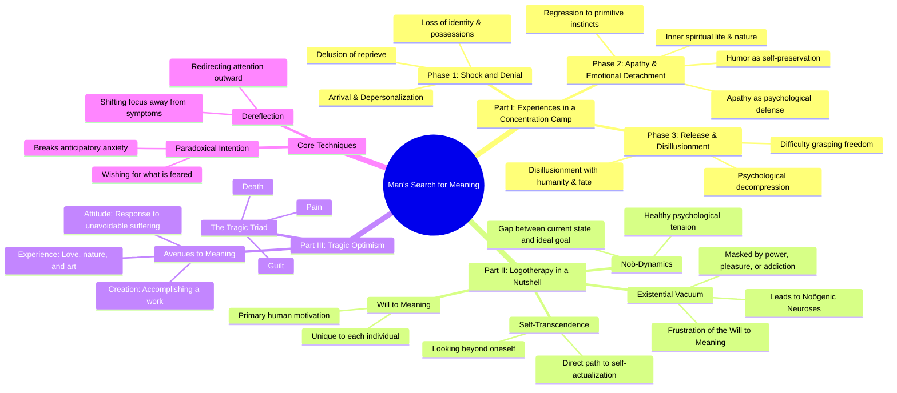

- General Overview
  - Central Thesis: Victory Without Battle
    - **Supreme excellence**: break enemy resistance without fighting, capturing his country whole - **Foreknowledge is essential**: know yourself, know your enemy, and know the terrain - **Speed over prolongation**: no nation ever benefited from a protracted war - **Deception is fundamental**: all warfare is based on appearing weak when strong, active when inactive
    - Strategic Foundations: Planning and Preparation
    - **Five Constant Factors**: Moral Law, Heaven, Earth, Commander, Method and Discipline determine outcomes - **Seven Comparisons**: weigh sovereign, general, terrain, discipline, strength, training, and rewards before battle - **Many calculations win**: thorough temple planning ensures victory; insufficient forethought guarantees defeat - **Know when to fight**: advance or retreat by circumstance, never by sovereign interference
    - Offensive Strategy: Attacking Without Siege
    - **Hierarchy of generalship**: baulk enemy plans, prevent junction, attack in field—siege is worst - **Five essentials for victory**: know when to fight, handle forces, unify spirit, seize initiative, avoid sovereign meddling - **Know enemy and self**: fear no result of a hundred battles; know only self, suffer defeats too
    - Tactical Dispositions: Invincibility First
    - **Invincibility in defense**: hide like earth's secret recesses; attack like heaven's thunderbolt - **True excellence unseen**: win without shedding blood, before common men recognize victory - **Five steps of method**: measurement, estimation, calculation, balancing chances, then victory - **Overwhelming force**: a victorious army is like a pound against a grain in the scale
    - Energy and Maneuver: Direct and Indirect Tactics
    - **Cheng and ch'i**: direct engagement fixes enemy; indirect surprise secures victory - **Infinite combinations**: like five notes or five colors, two methods yield endless variations - **Energy like a crossbow**: store potential force; release like a trigger at the decisive moment - **Momentum over individuals**: rely on massed force like a round stone rolling downhill
    - Weak Points and Strong: Seize Initiative
    - **Impose your will**: fight on your terms; arrive first, fresh and rested - **Attack undefended**: strike where enemy lacks preparation; be invisible and inaudible - **Concentrate vs. divide**: keep forces united; make enemy split his to guard everywhere - **Adapt like water**: never repeat tactics; let methods flow from infinite circumstances
    - Terrain and Situations: Reading the Ground
    - **Six types of terrain**: accessible, entangling, temporising, narrow passes, heights, distant—each demands different tactics - **Nine situations**: from dispersive home ground to desperate death ground—each requires specific response - **Plunge into deadly peril**: forced desperation unleashes fight-or-die ferocity; burn boats, break cooking-pots - **Terrain is an ally**: but estimating enemy, controlling victory, and calculating dangers is the general's test
    - Intelligence and Fire: The Decisive Tools
    - **Five fire attacks**: burn soldiers, stores, baggage, arsenals, or use dropping fire from crossbows - **Fire vs. water**: fire annihilates; water only intercepts and divides - **Five spy classes**: local, inward, converted, doomed, surviving—all depend on the converted spy - **Foreknowledge from men only**: not spirits, induction, or calculation—spies are the army's eyes and ears
- Deep Dive
  - Chapter I. LAYING PLANS
    - The Five Constant Factors
      - **Moral Law**: complete accord between ruler and people, so they follow regardless of danger - **Heaven**: night and day, cold and heat, times and seasons - **Earth**: distances, danger and security, open and narrow ground - **The Commander**: wisdom, sincerity, benevolence, courage, strictness - **Method and Discipline**: army subdivisions, rank gradations, supply roads, expenditure control
        - The Seven Comparisons
      - **Sovereign's Moral Law**: which ruler is in harmony with his subjects? - **General's Ability**: which commander has greater talent? - **Advantages of Heaven and Earth**: who holds the natural edge? - **Discipline**: on which side is it most rigorously enforced? - **Strength**: which army is stronger in morale and numbers? - **Training**: which side has better-prepared officers and men? - **Rewards and Punishments**: where is constancy in both greatest?
        - The Role of Circumstance and Deception
      - **Modify plans**: avail yourself of helpful circumstances beyond ordinary rules - **All warfare is deception**: seem unable when able, inactive when active - **Feign weakness**: irritate a choleric foe, make him arrogant - **Attack unprepared**: appear where unexpected, strike where unready
        - The Necessity of Deliberation
      - **Many calculations win**: the general who plans thoroughly in the temple prevails - **Few calculations lose**: insufficient forethought guarantees defeat - **No calculation is ruin**: victory is foreseen by attention to this principle
    - Chapter II. WAGING WAR
    - The True Cost of War
      - **Massive expenditure**: A 100,000-man army costs a thousand ounces of silver daily. - **Protracted war drains everything**: Weapons dull, morale drops, state resources collapse. - **Prolonged conflict invites predators**: Exhausted nations fall prey to opportunistic rivals. - **No nation ever benefited from long wars**: Speed is the only path to profit.
        - The Imperative of Speed
      - **Stupid haste beats clever delay**: Tardiness is always foolish; rapidity is the only wisdom. - **Know war's evils to wage it well**: Only those who grasp its costs can execute it swiftly. - **No second levies, no reloaded wagons**: A skilled general wins with the forces he brings.
        - Forage on the Enemy
      - **Live off the land**: Bring only war material; take food from the enemy. - **One cart of enemy provisions equals twenty of your own**: Transport costs make local supply vastly cheaper. - **Distant supply chains impoverish the people**: High prices and heavy exactions drain the nation dry.
        - Turn Captured Strength Into Your Own
      - **Rouse men with anger, reward them with spoils**: Captured chariots and goods fuel motivation. - **Replace enemy flags, integrate their chariots**: Absorb captured equipment into your forces. - **Treat prisoners kindly and keep them**: Using the conquered foe augments your own strength.
        - The General's Ultimate Responsibility
      - **Great object: victory, not long campaigns**: War is not a thing to be trifled with. - **The leader of armies is the arbiter of fate**: He decides whether the nation faces peace or peril.
    - Chapter III. ATTACK BY STRATAGEM
    - The Supreme Ideal: Victory Without Fighting
      - **Supreme excellence**: break enemy resistance without fighting - **Capture intact**: take enemy’s country whole, armies entire - **Siege is worst policy**: costly, slow, kills one-third of your men - **Skilful leader**: subdues troops without battle, captures cities without siege
        - The Hierarchy of Generalship
      - **Best**: baulk the enemy’s plans with active counter-attack - **Next**: prevent the junction of enemy forces - **Next**: attack the enemy’s army in the field - **Worst**: besiege walled cities — avoid at all costs
        - The Five Essentials for Victory
      - **Know when to fight**: advance or retreat by circumstance - **Handle forces**: use superior and inferior numbers with adaptability - **Unified spirit**: army animated by same purpose throughout ranks - **Seize initiative**: prepared, wait to catch enemy unprepared - **No sovereign interference**: general with capacity must not be hampered
        - The Three Ways a Ruler Ruins an Army
      - **Hobbling the army**: ignorant orders to advance or retreat - **Misgoverning**: ruling army like a kingdom, ignoring military conditions - **Wrong officers**: employing men without regard to adaptability
        - The Fundamental Principle of Knowledge
      - **Know enemy and self**: fear no result of a hundred battles - **Know self only**: for every victory, also suffer a defeat - **Know neither**: succumb in every battle
    - Chapter IV. TACTICAL DISPOSITIONS
    - Invincibility and Vulnerability
      - **Invincibility**: lies in one's own hands through defense and concealment - **Opportunity to defeat enemy**: provided by the enemy's own mistakes - **Defense**: used when strength is insufficient; **attack**: when strength is superabundant - **Skilled defense**: hides like in the secret recesses of the earth - **Skilled attack**: strikes like a thunderbolt from the topmost heavens
        - The Acme of Excellence
      - **True excellence**: winning without shedding blood, unseen by the common herd - **Foresight**: seeing victory before it is within the ken of ordinary men - **Easy victory**: the mark of a clever fighter, not hard-fought battles - **No reputation**: victories won before circumstances come to light earn no fame
        - The Certainty of Victory
      - **Making no mistakes**: establishes the certainty of victory - **Conquer already defeated**: the skillful fighter defeats an enemy already beaten - **Battle after victory**: the victorious strategist seeks battle only after winning - **Control success**: by cultivating the moral law and adhering to method and discipline
        - The Five Steps of Military Method
      - **Measurement**: derived from the Earth (terrain) - **Estimation of quantity**: derived from Measurement - **Calculation**: derived from Estimation of quantity - **Balancing of chances**: derived from Calculation - **Victory**: derived from Balancing of chances - **Overwhelming force**: a victorious army is like a pound against a grain in the scale
    - Chapter V. ENERGY
    - Organizing Force: Division & Signals
      - **Control of many**: same principle as few—divide into units with subordinate commanders - **Signals and signs**: the only difference between leading large and small armies - **Discipline enables deception**: simulated disorder requires perfect underlying order
        - Direct & Indirect Tactics (Cheng & Ch’i)
      - **Direct (cheng)**: normal frontal engagement to fix the enemy’s attention - **Indirect (ch’i)**: surprise maneuvers from unexpected quarters to secure victory - **Mutual interchange**: cheng and ch’i are circular—each can become the other - **Infinite combinations**: like five notes or five colors, two methods yield endless variations
        - Energy & Timing
      - **Energy like a crossbow**: potential force stored until the decisive moment - **Decision like a trigger**: the well-timed release that strikes with crushing impact - **Terrible onset**: the good fighter is swift and irresistible as a torrent or falcon
        - Deception & Momentum
      - **Feigned weakness**: simulate fear or disorder to lure the enemy into a trap - **Baits and ambushes**: sacrifice something so the enemy snatches—then strike with picked men - **Combined energy**: leverage the army’s momentum like a round stone rolling downhill - **Momentum over individuals**: rely on massed force, not perfection from single soldiers
    - Chapter VI. WEAK POINTS AND STRONG
    - Seize the Initiative
      - **First on the field**: arrive fresh and rested; the latecomer arrives exhausted - **Impose your will**: fight on your terms or not at all - **Control the enemy's movements**: lure him with advantages, or block him by striking what he must defend - **Harass and disrupt**: disturb his ease, starve his supplies, force him to march
        - Attack the Undefended, Defend the Unattackable
      - **Appear where needed**: march swiftly to unexpected points through unguarded country - **Strike weak spots**: succeed by attacking where the enemy lacks capacity, spirit, or preparation - **Hold invulnerable positions**: defend only places the enemy cannot attack - **Master of attack**: the opponent does not know what to defend; **master of defense**: the opponent does not know what to attack - **Be invisible and inaudible**: hold the enemy's fate by remaining formless and soundless
        - Force or Avoid Battle at Will
      - **Force engagement**: attack a place the enemy must relieve, even behind strong fortifications - **Avoid engagement**: baffle the enemy with unexpected actions, making him suspect a trap - **Concentrate vs. divide**: keep your forces united; make the enemy split his to guard everywhere - **Many against few**: pit your whole force against fractions of the enemy's divided army
        - Conceal Time and Place
      - **Keep battle plans secret**: the enemy must prepare at many points, weakening each - **Reinforce everywhere, be weak everywhere**: strengthening one wing weakens another - **Know time and place**: concentrate from great distances to fight; ignorance leaves wings unable to support each other - **Victory despite numbers**: if the enemy cannot know when or where you strike, numbers are useless
        - Adapt Like Water
      - **Reveal the enemy's plans**: rouse him to learn his activity; force him to show vulnerable spots - **Compare strengths and weaknesses**: know where your army is abundant or deficient - **Conceal your dispositions**: hide your tactics from spies and clever minds - **Evolve victory from strategy**: the multitude sees the battle, not the prior planning - **Never repeat tactics**: let methods flow from infinite circumstances, like water shaping to the ground - **Avoid the strong, strike the weak**: like water running downhill, take the line of least resistance - **No constant conditions**: modify tactics to win; be a heaven-born captain
    - Chapter VII. MANŒUVERING
    - The Difficulty of Manoeuvering
      - **Core challenge**: turning the devious into the direct, and misfortune into gain - **Artifice of deviation**: take a long route to entice the enemy, then arrive first - **Risk of forced marches**: a 100-li march loses nine-tenths of your army; 50 li loses half - **Essential supplies**: an army without baggage, provisions, or bases of supply is lost
        - Prerequisites for Movement
      - **Know your neighbours**: form no alliances without understanding their designs - **Know the terrain**: be familiar with mountains, forests, pitfalls, marshes, and swamps - **Use local guides**: only they let you turn natural advantages to account
        - The General's Conduct
      - **Dissimulation**: practise deception; move only for real advantage - **Speed and stillness**: be swift as the wind, compact as the forest, fierce as fire, immovable as a mountain - **Plans and strikes**: let plans be dark as night; when you move, fall like a thunderbolt - **Spoils and territory**: divide plunder fairly; allot captured land to soldiers
        - Command and Communication
      - **Signals unify**: gongs, drums, banners, and flags focus the host's ears and eyes - **Single body**: with unified signals, neither the brave can advance alone nor the coward retreat alone - **Day and night**: use flags by day, signal-fires and drums by night
        - Reading the Enemy's Spirit
      - **Rob the spirit**: attack when the enemy's keen morning spirit flags toward evening - **Presence of mind**: stay disciplined and calm while awaiting the enemy's disorder - **Husband strength**: be near the goal while the enemy is far; wait at ease while he toils - **Study circumstances**: do not intercept an enemy with perfect banners or calm array
        - Tactical Prohibitions
      - **Terrain and traps**: do not advance uphill or oppose a downhill enemy - **Feigned flight**: do not pursue an enemy who simulates flight - **Bait and retreat**: do not swallow bait; do not interfere with an army returning home - **Surrounded foe**: leave an outlet free; do not press a desperate enemy too hard
    - Chapter VIII. VARIATION OF TACTICS
    - The Core of Tactical Variation
      - **Definition**: "Nine Variations" means an indefinite number of tactical deflections from the ordinary course - **Mastery**: The general who understands variation's advantages knows how to handle troops - **Ignorance**: Knowing terrain is useless without tactical versatility - **Five Advantages**: Even knowing obvious good moves (short roads, isolated foes, weak towns) is worthless without the wisdom to decline them
        - When to Defy Standard Doctrine
      - **Terrain rules**: Do not encamp in difficult country; join allies at crossroads; do not linger in isolated positions - **Desperate measures**: In hemmed-in situations use stratagem; in desperate positions fight - **Roads not followed**: Avoid paths where ambush is likely - **Armies not attacked**: Refrain when you cannot inflict a real defeat - **Towns not besieged**: Skip cities that cannot be held or will cause no trouble if left - **Commands not obeyed**: Subordinate even the sovereign's wishes to military necessity
        - Blending Advantage and Disadvantage
      - **Dual vision**: In advantage, always foresee the enemy's potential harm - **Rescue through risk**: In difficulty, seek the advantage that can free you — bold counter-attack beats timid escape - **Tempered expectation**: Letting disadvantage temper your plans helps accomplish essential schemes
        - Active Measures Against the Enemy
      - **Damage chiefs**: Entice away counselors, sow dissension, corrupt morals with gifts, waste his treasure - **Keep them busy**: Prevent rest, hold out specious allurements to make them rush to your chosen point - **Self-reliance**: Depend on your readiness to receive the enemy, not on his likelihood of not coming
        - Five Dangerous Faults of a General
      - **Recklessness**: Leads to destruction — the mad bull who fights blindly - **Cowardice**: Leads to capture — the man who will never take a risk - **Hasty temper**: Can be provoked by insults into fatal sorties - **Sensitive honor**: Stung by slander, however undeserved - **Over-solicitude**: Sacrifices military advantage for immediate troop comfort, prolonging war
    - Chapter IX. THE ARMY ON THE MARCH
    - Encamping by Terrain
      - **Mountains**: Pass quickly, keep near valleys; camp high, facing the sun; never climb to fight. - **Rivers**: After crossing, move far from the bank; let half the enemy cross before attacking. - **Salt-marshes**: Cross without delay; if forced to fight, keep water and grass near, back to trees. - **Dry plains**: Take an accessible position with rising ground to your right and rear.
        - Reading the Enemy's Signs
      - **Movement**: Trees shaking signals advance; birds rising reveals an ambush; dust columns indicate chariots, low dust infantry. - **Behavior**: Humble words with increased preparations mean attack is coming; violent bluster signals retreat. - **Camp clues**: Clamor by night betrays nervousness; shifting flags point to sedition; whispering in knots shows disaffection.
        - Assessing Enemy Condition
      - **Supplies**: Soldiers leaning on spears are faint from hunger; drawing water and drinking first signals thirst. - **Morale**: Too many rewards mean resources are exhausted; too many punishments reveal dire distress. - **Intent**: Feeding horses grain and killing cattle for food shows a fight to the death; peace proposals without a covenant indicate a plot.
        - Command and Discipline
      - **Humanity first, then iron discipline**: Punish only after soldiers are attached; otherwise they are useless. - **Consistent enforcement**: Habitually enforced commands create a well-disciplined army. - **Mutual confidence**: The general trusts his men and insists on obedience; the gain is shared by both.
    - Chapter X. TERRAIN
    - Six Types of Terrain
      - **Accessible ground**: Occupy raised, sunny spots first and guard supply lines - **Entangling ground**: Sally forth only if enemy is unprepared; retreat impossible otherwise - **Temporising ground**: Do not stir; lure enemy out, then attack his exposed part - **Narrow passes**: Occupy first and garrison strongly; if enemy holds, attack only if weak - **Precipitous heights**: Seize sunny heights and wait; if enemy holds, retreat and entice - **Distant ground**: Equal strength makes battle disadvantageous; avoid long marches
        - Six Calamities from General's Faults
      - **Flight**: hurling a small force against one ten times its size - **Insubordination**: soldiers too strong, officers too weak - **Collapse**: officers too strong, soldiers too weak - **Ruin**: angry officers give battle on their own before commander's decision - **Disorganisation**: weak general, unclear orders, no fixed duties, slovenly ranks - **Rout**: misjudging enemy strength, neglecting to place picked soldiers in front
        - The Great General's Art
      - **Terrain is an ally**: but estimating enemy, controlling victory, and calculating dangers is the test - **Fight only for victory**: even against ruler's orders; retreat without fearing disgrace - **Jewel of the kingdom**: the general who protects his country, not his own fame
        - Command and Discipline
      - **Treat soldiers as sons**: they will follow into deepest valleys and stand by you unto death - **Spoilt children are useless**: indulgence without authority, kindness without commands, inability to quell disorder - **Complete victory requires three knowledges**: yourself, the enemy, and the ground
    - Chapter XI. THE NINE SITUATIONS
    - The Nine Grounds Defined
      - **Dispersive ground**: fighting in one's own territory; soldiers may scatter to their homes - **Facile ground**: shallow penetration into enemy land; easy retreat tempts desertion - **Contentious ground**: possession gives great advantage to either side; a strategic prize - **Open ground**: both sides have liberty of movement; blocking the enemy is futile - **Ground of intersecting highways**: key to three contiguous states; first occupant commands allies - **Serious ground**: deep in hostile country with fortified cities in the rear - **Difficult ground**: mountain forests, marshes, and rugged terrain hard to traverse - **Hemmed-in ground**: narrow gorges where few enemies can crush a large force - **Desperate ground**: no escape; survival depends on fighting without delay
        - Tactical Responses to Each Ground
      - **Dispersive**: do not fight; instead, inspire unity of purpose - **Facile**: do not halt; maintain close connection between all army parts - **Contentious**: do not attack first; hurry up your rear to seize the position - **Open**: do not block the enemy's way; keep vigilant on defenses - **Intersecting highways**: join hands with allies; consolidate alliances - **Serious**: gather plunder; ensure a continuous stream of supplies - **Difficult**: keep steadily on the march; push on along the road - **Hemmed-in**: resort to stratagem; block any way of retreat to force desperation - **Desperate**: fight with all might; proclaim the hopelessness of saving lives
        - Principles of Command in Deep Invasion
      - **Penetrate deeply**: the further you go, the greater your troops' solidarity - **Rapidity is the essence**: take advantage of enemy's unreadiness by unexpected routes - **Seize what the enemy holds dear**: this makes him amenable to your will - **Drive a wedge**: prevent cooperation between enemy's front and rear, large and small divisions - **Mystify your own men**: keep them ignorant of plans; alter arrangements to confuse the enemy
        - Forging a Desperate, Unified Fighting Force
      - **Throw soldiers into positions with no escape**: they will prefer death to flight and fight hard - **Prohibit omens and superstitions**: remove fear of calamity until death itself - **Burn boats and break cooking-pots**: make return impossible; lead like a shepherd driving sheep - **Bestow rewards and issue orders without fixed rules**: handle the whole army as one man - **Place the army in deadly peril**: it will survive; plunge it into desperate straits for safety
        - The Desperate Strait Strategy
      - **Han Hsin's gambit**: arrayed troops with river at back, defying conventional tactics - **Officers' confusion**: questioned how victory came from "deadly peril" position - **Han's reply**: "Plunge army into desperate straits and it will survive" - **Key insight**: forced desperation prevents flight, unleashes fight-or-die ferocity - **Admission**: "These are higher tactics than we should have been capable of"
        - Cunning and Timing
      - **Accommodate enemy's purpose**: feign stupidity, lure them into complacency - **Persistent flanking**: hang on enemy's flank to eventually kill commander-in-chief - **Seal borders**: block passes, destroy tallies, stop emissaries for secrecy - **Seize what enemy holds dear**: forestall opponent by timing arrival artfully - **Maiden then hare**: feign coyness until opening, then strike with irresistible speed
    - Chapter XII. THE ATTACK BY FIRE
    - The Five Targets of Fire Attack
      - **Burn soldiers in camp**: destroy the enemy's fighting force where it sleeps - **Burn stores**: destroy provisions, fuel, and fodder to starve the army - **Burn baggage-trains**: cut supply lines by destroying wagons and impedimenta - **Burn arsenals and magazines**: eliminate weapons, bullion, and clothing reserves - **Hurl dropping fire**: shoot flaming arrows from crossbows into enemy lines
        - Conditions and Timing
      - **Materials ready**: keep dry vegetation, reeds, grease, and oil prepared for ignition - **Season and stars**: attack in dry weather when moon is in constellations of rising wind - **Traitors or circumstance**: secure favorable conditions, not just internal spies
        - Five Developments to Exploit
      - **Fire inside, attack outside**: strike immediately when flames erupt in enemy camp - **Enemy stays calm**: bide your time; do not attack if fire fails to cause panic - **Flames at height**: follow up if practicable; otherwise hold position - **External fire assault**: do not wait for internal outbreak if terrain is flammable - **Windward position**: start fire upwind; never attack from the leeward side
        - Fire vs. Water as Weapons
      - **Fire shows intelligence**: its destructive power can annihilate an enemy completely - **Water only intercepts**: it blocks roads or divides armies but cannot destroy stores - **Day wind lasts**: a daytime breeze persists; a night breeze dies quickly
        - Strategic Discipline
      - **Cultivate enterprise**: seize favorable moments with heroic measures to avoid stagnation - **Plan ahead**: enlightened rulers lay plans; good generals cultivate resources - **Fight only for advantage**: move not unless you see gain; fight not unless critical - **No anger or pique**: a destroyed kingdom cannot be reborn; the dead cannot return
    - Chapter XIII. THE USE OF SPIES
    - The Moral Imperative of Foreknowledge
      - **War's cost**: raising armies drains the state and exhausts the people for years - **Inhumanity**: to grudge spy-pay while war drags on is a crime against humanity - **Foreknowledge**: the sole path to strike, conquer, and achieve the extraordinary - **No substitutes**: foreknowledge cannot come from spirits, induction, or calculation—only from other men
        - The Five Classes of Spies
      - **Local spies**: employ inhabitants of the enemy's district - **Inward spies**: use enemy officials—disgruntled, greedy, or turncoat - **Converted spies**: catch enemy spies, bribe them, and turn them to your service - **Doomed spies**: let our own spies leak false plans, knowing they'll be captured and killed - **Surviving spies**: ordinary agents who bring back news from the enemy camp
        - The Art of Handling Spies
      - **Intimacy and reward**: treat spies more intimately and liberally than anyone in the army - **Secrecy**: communicate mouth-to-ear; kill spy and confidant if a secret leaks early - **Qualities needed**: intuitive sagacity, benevolence, straightforwardness, and subtle ingenuity - **Targets first**: learn the names of the general's attendants, aides, door-keepers, and sentries
        - The Converted Spy as Linchpin
      - **Primary source**: all five varieties ultimately depend on the converted spy for reliable information - **Enables others**: through him you acquire local and inward spies, deploy doomed spies, and time surviving spies - **Historical proof**: the rise of Yin and Zhou dynasties came from men who had served the previous regime - **Essential element**: spies are an army's ears and eyes—on them depends the ability to move
- Core Conclusion and Practical Takeaways
  - Core Strategic Principles
    - **Victory without battle**: supreme excellence is breaking enemy resistance without fighting - **Know self and enemy**: a hundred battles with no danger of defeat - **Speed over duration**: no nation ever benefited from prolonged war - **Adapt like water**: let methods flow from infinite circumstances, never repeating tactics - **Seize initiative**: arrive first, fight on your terms, impose your will
    - Daily Practices for Strategic Thinking
    - **Plan before acting**: many calculations win; few calculations lose - **Compare strengths honestly**: measure yourself against opponents on moral law, ability, discipline, and training - **Conceal your intentions**: be formless and soundless so opponents cannot prepare - **Attack weak points**: strike where the enemy is unprepared, not where they are strong - **Forage and absorb**: live off available resources; turn captured strength into your own
    - Mindset Shifts for Leaders
    - **Cultivate the five virtues**: wisdom, sincerity, benevolence, courage, and strictness - **Avoid the five faults**: recklessness, cowardice, hasty temper, sensitive honor, and over-solicitude - **Treat soldiers as sons**: they will follow into valleys of death; but spoil them and they become useless - **Accept no interference**: the general must be free from sovereign meddling in military decisions - **Fight only for advantage**: move not unless you see gain; fight not unless critical
    - Practical Battlefield Tactics
    - **Use direct and indirect attacks**: fix enemy attention with normal engagement, strike with surprise - **Control timing and energy**: store force like a crossbow, release like a trigger - **Read enemy signs**: movement, behavior, camp clues reveal intentions and condition - **Exploit terrain**: let ground be your ally—occupy heights, avoid marshes, guard passes - **Create desperation**: plunge forces into positions with no escape to unleash fight-or-die ferocity
    - Intelligence and Information Warfare
    - **Invest in spies**: grudge spy-pay and you commit a crime against humanity - **Use all five spy types**: local, inward, converted, doomed, and surviving agents - **Convert enemy spies**: they become your primary source for all other intelligence - **Keep plans secret**: communicate mouth-to-ear; kill if secrets leak early - **Know your enemy's inner circle**: learn names of attendants, aides, door-keepers, and sentries
    - The Ultimate Takeaway
    - **War is a last resort**: a destroyed kingdom cannot be reborn; the dead cannot return - **Discipline enables deception**: simulated disorder requires perfect underlying order - **Momentum over individuals**: rely on massed force and energy, not perfection from single soldiers - **Humanity first, then iron discipline**: punish only after soldiers are attached; otherwise they are useless - **Foreknowledge from men, not spirits**: the path to victory comes through human intelligence, not omens or calculation

- [ ] Watermark removing
- [ ] compressing the Image
- [ ] Upload the Image to the relevant question

## Chapter 10

1. Image changes
  1. Arjuna in the pitch black
  2. crocodile
  3. eye of the bird
2. Flashcards are ready to story
