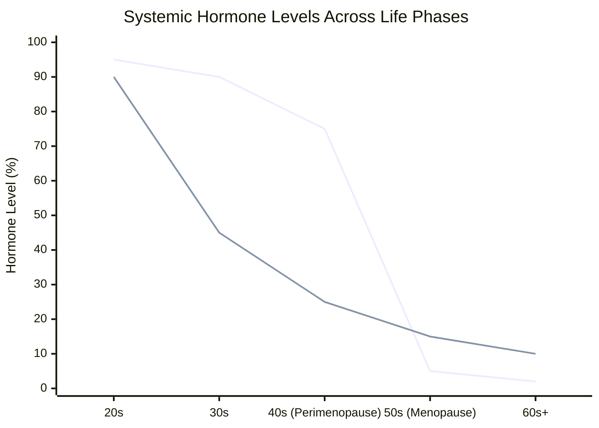
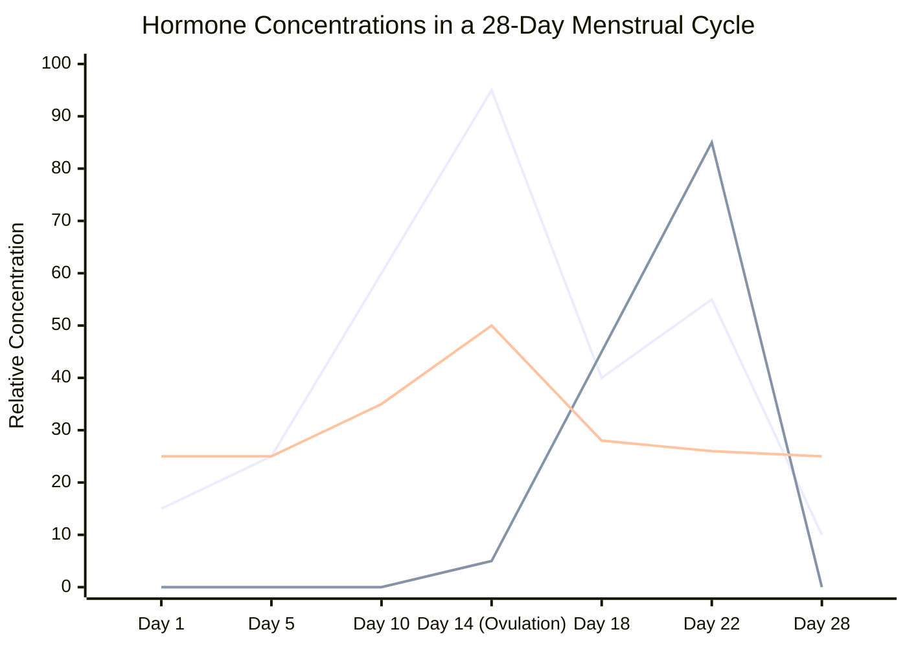
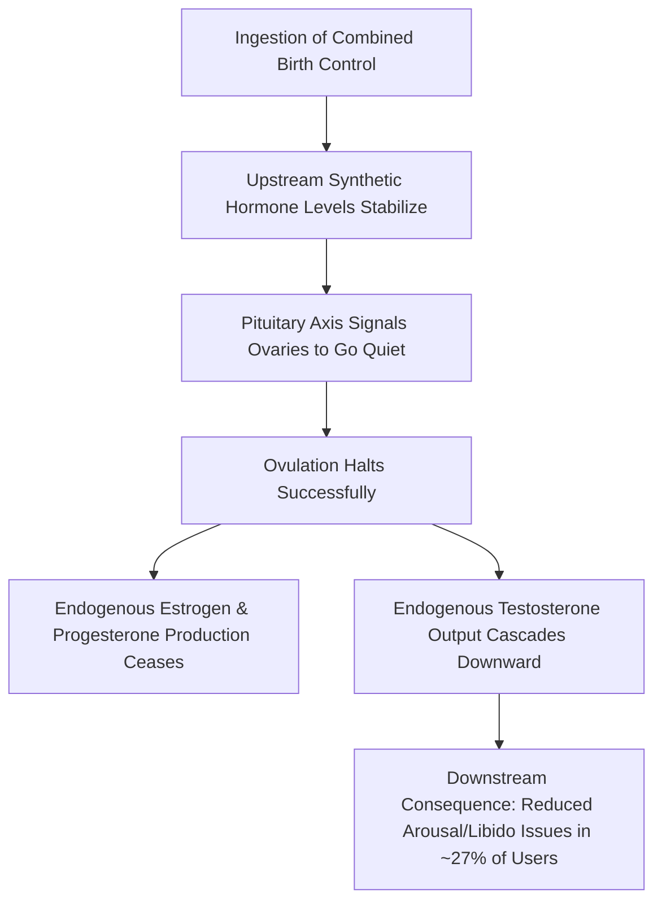
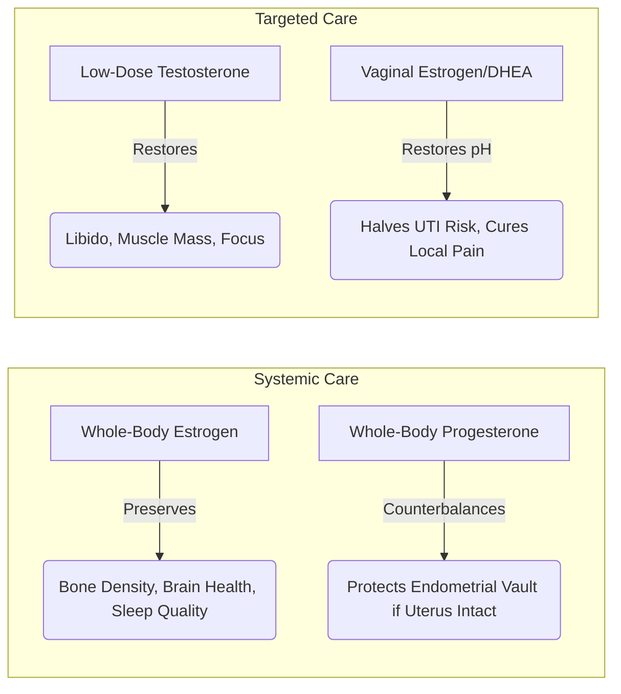
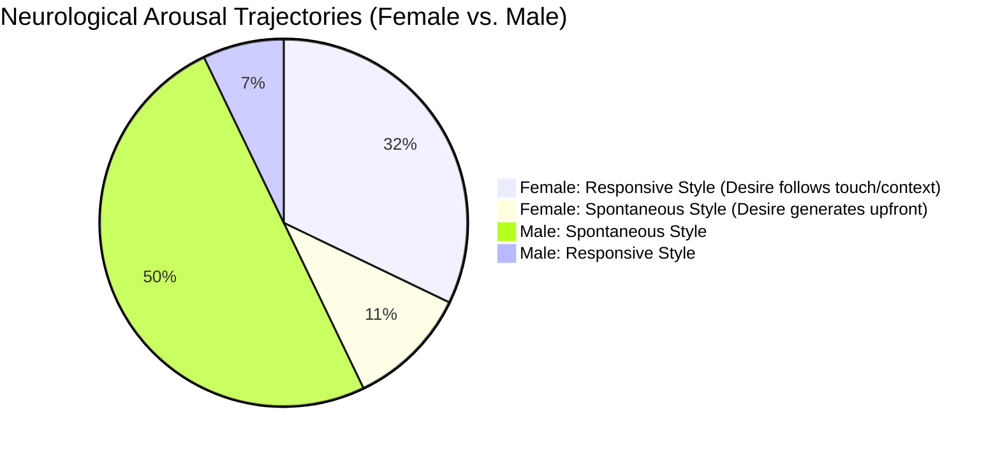

# Notes: Dr. Rachel Rubin – The Diary of a CEO
*Topic: Female Hormonal Architecture, Sexual Health, and Relationship Communication*
https://youtu.be/MM-Qhlxf1pM

---

## 📈 1. Lifecycle Hormonal Shift Visualizations

### A. The 30s Female Testosterone Drop vs. Estrogen Timeline
Textbook training often states that all female hormones collapse strictly at menopause (age 45–55). Dr. Rubin highlights a major medical misconception: female testosterone begins its sharp, precipitous decline much earlier—during a woman's 30s—well before estrogen falls zero

### The 28-Day Menstrual Cycle Balance

​During a healthy, non-medicated cycle, estrogen rises steadily to drop an egg at ovulation, while progesterone spikes uniquely in the second half (luteal phase). Testosterone shows a minor surge at ovulation to facilitate evolutionary reproductive drive.

# 2. The Contraceptive Pipeline & Systematic Suppression
​Combined oral contraceptive pills function by delivering synthetic quantities of estrogen and progesterone to override the master control axis. A significant clinical trade-off is the down-regulation of endogenous testosterone production.

# 3. The Local Vaginal Microbiome & UTI Pathway

​The local vaginal vault relies completely on sufficient hormone levels (Estrogen and Testosterone) to maintain the glycogen storage required by _Lactobacillus_ species. A collapse in local levels degrades this barrier, allowing pathogenic infiltration.

```mermaid
flowchart TD
    A[Ovarian Decline / Lactation / Systemic Drop] --> B[Loss of Vaginal Acidity: pH Rises Above 4.5]
    B --> C[Lactobacillus Die Off / Protection Collapses]
    C --> D[Pathogenic Intestinal Bacteria Move Into Vault]
    D --> E[Ascending Colonization: Urethra into Bladder]
    E --> F[Recurrent Urinary Tract Infections / Urosepsis Risk]
    
    G[Application of Vaginal Estradiol or DHEA Cream] --> H[Direct Re-acidification of Local Tissue]
    H -->|Halves Incident Risk| F
    style G fill:#1b4d3e,stroke:#fff,stroke-width:2px;

```

## The 4-Bucket Menopause HRT Treatment Model

​Hormone Therapy (HRT) is often mistakenly treated as a uniform product. Clinical sexual medicine structures intervention into four independent, distinct diagnostic tracks:

1. **Whole-Body Estrogen:** Treats severe vasomotor instability (hot flashes, night sweats) and prevents systemic bone mineral density drop.
2. ​**Whole-Body Progesterone:** Required alongside systemic estrogen if a woman has an intact uterus to prevent over-thickening of the endometrial lining (mitigating endometrial cancer risk). Provides a significant sedative effect for sleep.
3. ​**Low-Dose Testosterone:** Administered at approximately \frac{1}{10}\text{th} of standard male dosages to clinically support arousal, clitoral engorgement, and overall energy balance.
4. ​**Local Vaginal Hormones:** Micro-doses of estradiol or DHEA creams, tablets, or slow-release rings. Because they do not absorb heavily into the central circulation, they carry zero systemic clot or cancer risks and remain safe for high-risk populations.

## ​🧠 5. The Orgasm Gap & Arousal Discrepancies

​Divergent baseline default tracks for neurological desire often trigger significant confusion and insecurity in long-term relationships:

- **Anatomical Iceberg:** Penetrative intercourse alone does not cause orgasm for the majority of women because the internal vaginal canal lacks specialized high-density nerve nodes. The clitoral complex is a highly internal, multi-tiered structure holding over 10,000 nerve endings, requiring direct or external stimulation.
- ​**Clitoral Adhesions:** In **23% of women**, the preputial hood becomes completely adhered to the clitoral glans due to cellular buildup or low-grade inflammation. Simple, minor in-office lysing of these adhesions improves orgasm response profiles by 60%–70%.
- ​**The Reframing Blueprint:** Marital conflict regarding libido or pain often stalls when couples search for a "bad guy." To break the cycle of shame, partnerships must reframe the dynamic from _Partner A vs. Partner B_ to **Partner A & Partner B vs. The Physiological Problem**.